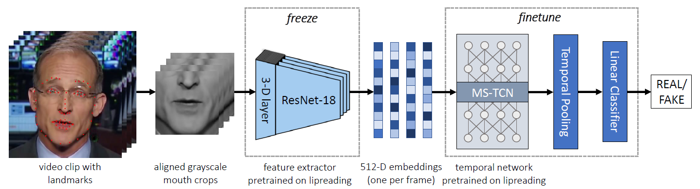

# Lips Don't Lie: A Generalisable and Robust Approach to Face Forgery Detection
This is a PyTorch implementation of the [LipForensics paper](https://arxiv.org/abs/2012.07657).



## Setup
### Install packages
```bash
pip install -r requirements.txt
```

Note: we used Python version 3.8 to test this code.
### Prepare data
1. Follow the links below to download the datasets (you will be asked to fill out some forms before downloading):
    * [FaceForensics++ (FF++) / FaceShifter (c23)](https://github.com/ondyari/FaceForensics) 
    * [DeeperForensics](https://github.com/EndlessSora/DeeperForensics-1.0)
    * [CelebDF-v2](https://github.com/yuezunli/celeb-deepfakeforensics)
    * [DFDC](https://ai.facebook.com/datasets/dfdc/) (the test set of the full version, not the Preview)
2. Extract the frames (e.g. using code in the [FaceForensics++ repo](https://github.com/ondyari/FaceForensics/blob/master/dataset/extract_compressed_videos.py).)
The filenames of the frames should be as follows: 0000.png, 0001.png, ....
3. Detect the faces and compute 68 face landmarks. For example, you can use [RetinaFace](https://github.com/biubug6/Pytorch_Retinaface) and [FAN](https://github.com/1adrianb/face-alignment) for good results. 

4. Place face frames and corresponding landmarks into the appropriate directories:
    * For FaceForensics++, FaceShifter, and DeeperForensics, frames for a given video should be 
    placed in `data/datasets/Forensics/{dataset_name}/{compression}/images/{video}`, where `dataset_name` is RealFF (real frames from FF++),
    Deepfakes, FaceSwap, Face2Face, NeuralTextures, FaceShifter, or DeeperForensics. `dataset_name` is c0, c23, or c40, corresponding 
    to no compression, low compression, and high compression, respectively. `video` is the video name and should be numbered as follows:
    000, 001, .... For example, the frame 0102 of real video 067 at c23 compression is found in `data/datasets/Forensics/RealFF/c23/images/067/0102.png`
    * For CelebDF-v2, frames for a given video should
    be placed in `data/datasets/CelebDF/{dataset_name}/images/{video}` where `dataset_name` is RealCelebDF, which should 
    include all real videos from the test set, or FakeCelebDF, which should include all fake videos from the test set. 
    * For DFDC, frames for a given video should be placed in `data/datasets/DFDC/images` (both real and fake). 
    The video names from the test set we used in
    our experiments are given in `data/datasets/DFDC/dfdc_all_vids.txt`. 
    
    The corresponding computed landmarks for each frame
    should be placed in `.npy` format in the directories defined by replacing `images` with `landmarks` above 
    (e.g. for video "000", the `.npy` files for each frame should be placed in `data/datasets/Forensics/RealFF/c23/landmarks/000`).
5. To crop the mouth region from each frame for all datasets, run
    ```bash
   python preprocessing/crop_mouths.py --dataset all
    ```
    This will write the mouth images into the corresponding `cropped_mouths` directory. 
    
## Evaluate
* Cross-dataset generalisation (Table 2 in paper):
    1. Download the [pretrained model](https://drive.google.com/file/d/1wfZnxZpyNd5ouJs0LjVls7zU0N_W73L7/view?usp=sharing)
    and place into `models/weights`. This model has been trained on FaceForensics++
    (Deepfakes, FaceSwap, Face2Face, and NeuralTextures) and is the one used to get the LipForensics video-level AUC 
    results in Table 2 of the paper, reproduced below:
        
        CelebDF-v2 | DFDC | FaceShifter | DeeperForensics
        :------------: | :-------------: | :-------------: | :-------------:
        82.4% | 73.5% | 97.1% | 97.6%
        
    2. To evaluate on e.g. FaceShifter, run
        ```bash
        python evaluate.py --dataset FaceShifter --weights_forgery ./models/weights/lipforensics_ff.pth
        ```

## Citation
If you find this repo useful for your research, please consider citing the following:
```bibtex
@inproceedings{haliassos2021lips,
  title={Lips Don't Lie: A Generalisable and Robust Approach To Face Forgery Detection},
  author={Haliassos, Alexandros and Vougioukas, Konstantinos and Petridis, Stavros and Pantic, Maja},
  booktitle={Proceedings of the IEEE/CVF Conference on Computer Vision and Pattern Recognition},
  pages={5039--5049},
  year={2021}
}
```
